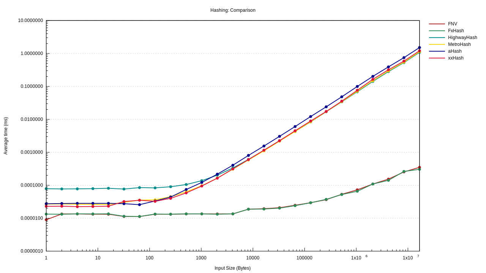

# Hash function benchmarks

This repo contains benchmarks for the following hash functions:

- [aHash](https://crates.io/crates/ahash)
- [FNV](https://crates.io/crates/fnv)
- [FxHash](https://crates.io/crates/fxhash)
- [HighwayHash](https://crates.io/crates/highway)
- [MetroHash](https://crates.io/crates/metrohash)
- [xxHash](https://crates.io/crates/twox-hash)

The benchmark constists of hashing `&[u8]`.

